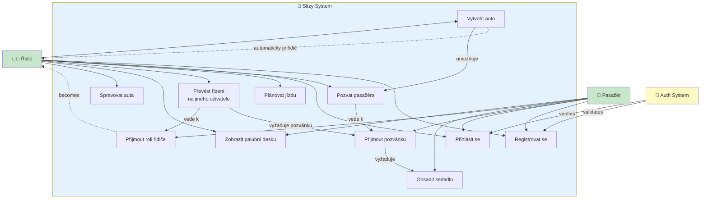

# Use Case Diagram - Role a Interakce

```mermaid
graph TB
    subgraph Sitzy["🚗 Sitzy System"]
        UC1["Registrovat se"]
        UC2["Přihlásit se"]
        UC3["Vytvořit auto"]
        UC4["Pozvat pasažéra"]
        UC5["Přijmout pozvánku"]
        UC6["Obsadit sedadlo"]
        UC7["Plánovat jízdu"]
        UC8["Převést řízení<br/>na jiného uživatele"]
        UC9["Přijmout roli řidiče"]
        UC10["Zobrazit palubní desku"]
        UC11["Spravovat auta"]
    end
    
    Driver["👨‍✈️ Řidič"]
    Passenger["👤 Pasažér"]
    System["🔐 Auth System"]
    
    Driver --> UC1
    Driver --> UC2
    Driver --> UC3
    Driver --> UC4
    Driver --> UC7
    Driver --> UC8
    Driver --> UC10
    Driver --> UC11
    
    Passenger --> UC1
    Passenger --> UC2
    Passenger --> UC5
    Passenger --> UC6
    Passenger --> UC9
    Passenger --> UC10
    
    System -->|validates| UC1
    System -->|verifies| UC2
    
    UC3 -.->|automaticky je řidič| Driver
    UC3 -->|umožňuje| UC4
    UC4 -->|vede k| UC5
    UC5 -->|vyžaduje| UC6
    UC8 -->|vyžaduje pozvánku| UC5
    UC8 -->|vede k| UC9
    UC9 -.->|becomes| Driver
    
    style Sitzy fill:#e3f2fd
    style Driver fill:#c8e6c9
    style Passenger fill:#c8e6c9
    style System fill:#fff9c4
```

**Poznámka:** Majitel se automaticky stává prvním řidičem při vytvoření auta.
