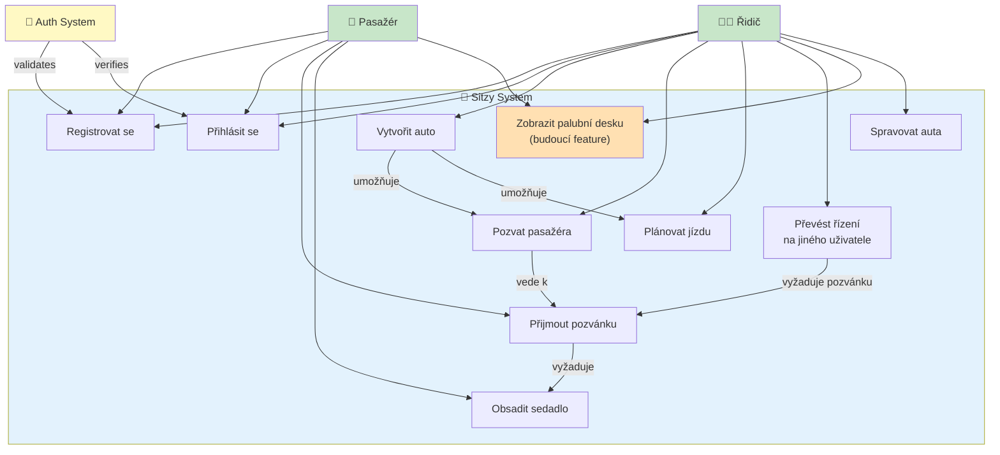

# Use Case Diagram - Role a Interakce

**Poznámky:**

- Majitel auta vytváří jízdy (UC7), při kterých se automaticky stává řidičem
- UC8 (Transfer řízení) vyžaduje, aby nový řidič měl přijatou pozvánku
- UC10 (Dashboard) je označen jako budoucí feature
- Přijetí role řidiče (UC9) je součástí UC8 - není potřeba samostatný use case
