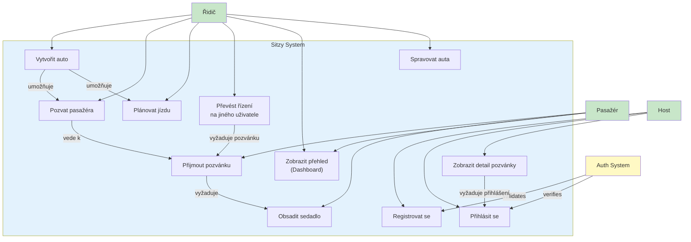

# Use Case Diagram - Role a Interakce

- **Poznámky:**
- Majitel auta vytváří jízdy (UC7), při kterých se automaticky stává řidičem
- UC8 (Transfer řízení) vyžaduje, aby nový řidič měl přijatou pozvánku
- UC10 (Dashboard) je hlavní přehledová stránka s rychlými akcemi a nejbližší jízdou
- Přijetí role řidiče (UC9) je součástí UC8 - není potřeba samostatný use case
- Host (Guest) může zobrazit detaily pozvánky (UC12), ale pro její přijetí (UC5) a obsazení sedadla (UC6) je vyžadováno přihlášení (UC2) nebo registrace (UC1)

