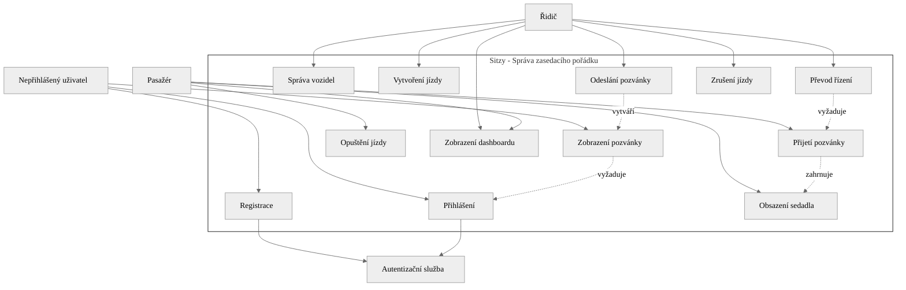

# UML Diagram případů užití (Use Case Diagram) – Sitzy

Tento diagram znázorňuje aktéry systému Sitzy a jejich případy užití.

```mermaid
%%{init: {"theme": "neutral", "themeVariables": {"fontFamily": "sans-serif", "clusterBkg": "none", "clusterBorder": "#000000"}}}%%
graph TD
    %% Definice aktérů
    Guest["Nepřihlášený uživatel"]
    Driver["Řidič"]
    Passenger["Pasažér"]
    AuthSys["Autentizační služba"]

    %% Systémová hranice
    subgraph Sitzy["Sitzy - Správa zasedacího pořádku"]
        UC_Reg["Registrace"]
        UC_Log["Přihlášení"]
        UC_Resolve["Zobrazení pozvánky"]
        UC_CreateCar["Správa vozidel"]
        UC_CreateRide["Vytvoření jízdy"]
        UC_Invite["Odeslání pozvánky"]
        UC_Transfer["Převod řízení"]
        UC_CancelRide["Zrušení jízdy"]
        UC_Accept["Přijetí pozvánky"]
        UC_Seat["Obsazení sedadla"]
        UC_Leave["Opuštění jízdy"]
        UC_Dash["Zobrazení dashboardu"]
    end

    %% Vazby - Host
    Guest --> UC_Reg
    Guest --> UC_Log
    Guest --> UC_Resolve

    %% Vazby - Řidič
    Driver --> UC_CreateCar
    Driver --> UC_CreateRide
    Driver --> UC_Invite
    Driver --> UC_Transfer
    Driver --> UC_CancelRide
    Driver --> UC_Dash

    %% Vazby - Pasažér
    Passenger --> UC_Accept
    Passenger --> UC_Seat
    Passenger --> UC_Leave
    Passenger --> UC_Dash

    %% Vazby na externí systémy
    UC_Reg --> AuthSys
    UC_Log --> AuthSys

    %% Relace mezi případy užití (Inclusions / Extensions / Dependencies)
    UC_Invite -.->|vytváří| UC_Resolve
    UC_Resolve -.->|vyžaduje| UC_Log
    UC_Accept -.->|zahrnuje| UC_Seat
    UC_Transfer -.->|vyžaduje| UC_Accept

    %% Stylování ohraničení bez pozadí
    style Sitzy fill:none,stroke:#000000,stroke-width:1px
```
