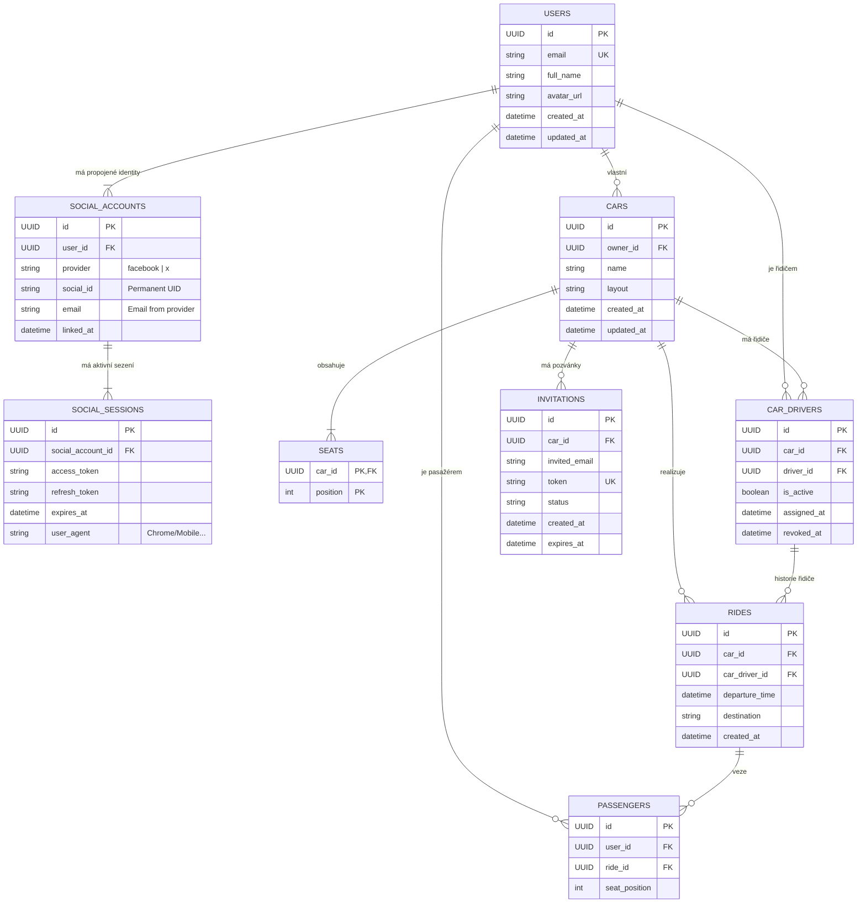

# ER Diagram - Budoucí Architektura (s OAuth)

## Klíčové vylepšení:

### 🔐 OAuth Autentizace

- **SOCIAL_ACCOUNTS** - trvalé propojení uživatele s OAuth providerem
- **SOCIAL_SESSIONS** - dočasné access tokeny (pro revokaci)
- `USERS.hashed_password` odstraněno (pouze OAuth)

### 🚗 Více aut na uživatele

- `USERS ||--o{ CARS` místo 1:1

### 👨‍✈️ Oddělení majitel vs. řidič

- **CAR_DRIVERS** - historie přiřazení řidičů
- Právě jeden aktivní řidič na auto (`is_active=true`)
- `RIDES.car_driver_id` odkazuje na konkrétní záznam historie

### 📊 Optimalizace

- **SEATS** má composite PK `(car_id, position)` místo UUID
- Žádné zbytečné `status` pole (odvozuje se z času)
- `PASSENGERS.booked_at` odstraněno (duplicitní k pozvánkám)
