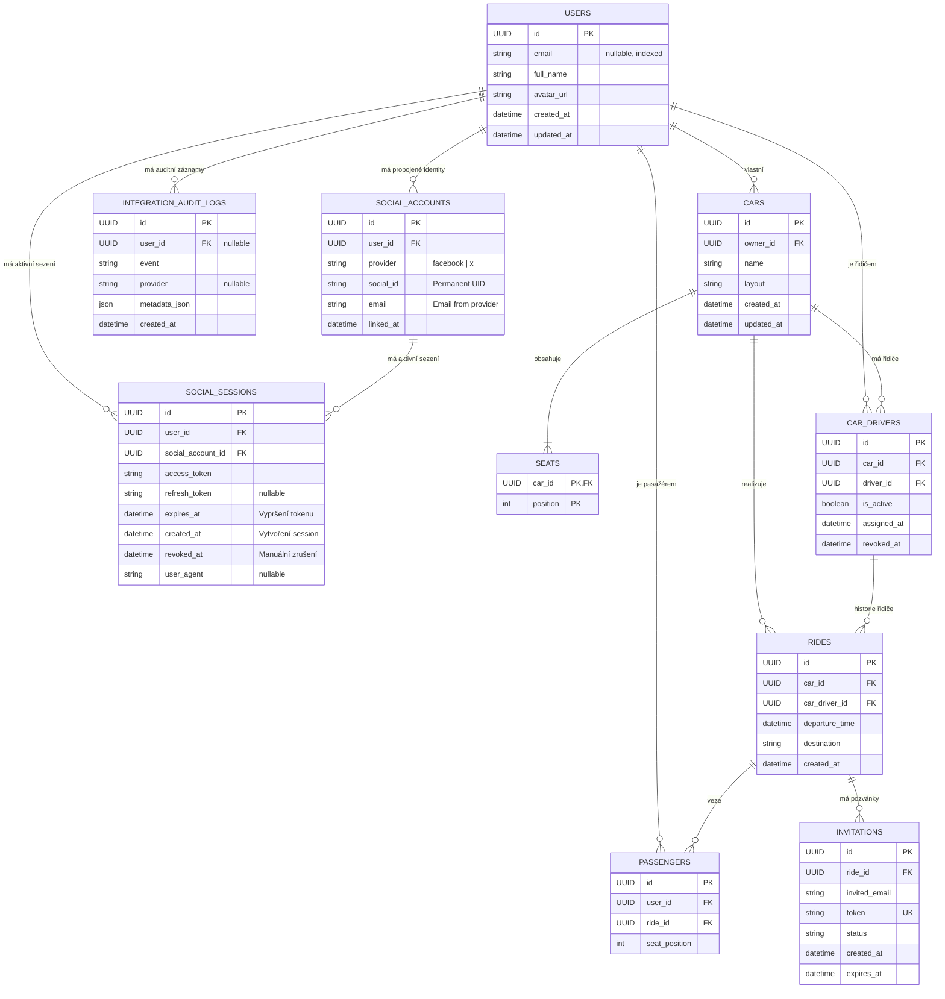

# ER Diagram - Aktuální Architektura (s OAuth)

```mermaid
erDiagram
    %% --- UŽIVATELÉ ---
    USERS {
        UUID id PK
        string email "nullable, indexed"
        string full_name
        string avatar_url
        datetime created_at
        datetime updated_at
    }

    %% --- IDENTITA (Trvalé propojení) ---
    SOCIAL_ACCOUNTS {
        UUID id PK
        UUID user_id FK
        string provider "facebook | x"
        string social_id "Permanent UID"
        string email "Email from provider"
        datetime linked_at
    }

    %% --- RELACE / TOKENY (Dočasné klíče) ---
    SOCIAL_SESSIONS {
        UUID id PK
        UUID user_id FK
        UUID social_account_id FK
        string access_token
        string refresh_token "nullable"
        datetime expires_at "Vypršení tokenu"
        datetime created_at "Vytvoření session"
        datetime revoked_at "Manuální zrušení"
        string user_agent "nullable"
    }

    %% --- AUDIT LOG ---
    INTEGRATION_AUDIT_LOGS {
        UUID id PK
        UUID user_id FK "nullable"
        string event
        string provider "nullable"
        json metadata_json
        datetime created_at
    }

    %% --- DOMÉNA APLIKACE ---
    CARS {
        UUID id PK
        UUID owner_id FK
        string name
        string layout
        datetime created_at
        datetime updated_at
    }

    SEATS {
        UUID car_id PK,FK
        int position PK
    }

    CAR_DRIVERS {
        UUID id PK
        UUID car_id FK
        UUID driver_id FK
        boolean is_active
        datetime assigned_at
        datetime revoked_at
    }

    RIDES {
        UUID id PK
        UUID car_id FK
        UUID car_driver_id FK
        datetime departure_time
        string destination
        datetime created_at
    }

    PASSENGERS {
        UUID id PK
        UUID user_id FK
        UUID ride_id FK
        int seat_position
    }

    INVITATIONS {
        UUID id PK
        UUID ride_id FK
        string invited_email
        string token UK
        string status
        datetime created_at
        datetime expires_at
    }

    %% --- VAZBY ---
    USERS ||--o{ CARS : "vlastní"
    USERS ||--o{ SOCIAL_ACCOUNTS : "má propojené identity"
    USERS ||--o{ SOCIAL_SESSIONS : "má aktivní sezení"
    USERS ||--o{ INTEGRATION_AUDIT_LOGS : "má auditní záznamy"
    USERS ||--o{ CAR_DRIVERS : "je řidičem"
    USERS ||--o{ PASSENGERS : "je pasažérem"
    
    SOCIAL_ACCOUNTS ||--o{ SOCIAL_SESSIONS : "má aktivní sezení"

    CARS ||--|{ SEATS : "obsahuje"
    CARS ||--o{ CAR_DRIVERS : "má řidiče"
    CARS ||--o{ RIDES : "realizuje"

    CAR_DRIVERS ||--o{ RIDES : "historie řidiče"
    
    RIDES ||--o{ PASSENGERS : "veze"
    RIDES ||--o{ INVITATIONS : "má pozvánky"
```

## Klíčové vylepšení:

### 🔐 OAuth Autentizace

- **SOCIAL_ACCOUNTS** - trvalé propojení uživatele s OAuth providerem
- **SOCIAL_SESSIONS** - dočasné access/refresh tokeny s revokací (dual FK na
user i social_account)
- `USERS.email` je nullable (X nemusí poskytovat email)
- `INTEGRATION_AUDIT_LOGS` - audit změn OAuth/session integrací

### 🚗 Více aut na uživatele

- `USERS ||--o{ CARS` místo 1:1

### 👨‍✈️ Oddělení majitel vs. řidič

- **CAR_DRIVERS** - historie přiřazení řidičů
- Právě jeden aktivní řidič na auto (`is_active=true`)
- `RIDES.car_driver_id` odkazuje na konkrétní záznam historie

### 🎫 Pozvánky na jízdy

- **INVITATIONS** - vázány na konkrétní jízdu (`ride_id`), ne auto
- Umožňuje pozvat uživatele na konkrétní jízdu emailem
- Po přijetí se vytvoří `PASSENGER` záznam

### 📊 Optimalizace

- **SEATS** má composite PK `(car_id, position)` místo UUID
- **INVITATIONS.status** je explicitní enum, stav session se určuje přes
`expires_at` a `revoked_at`
