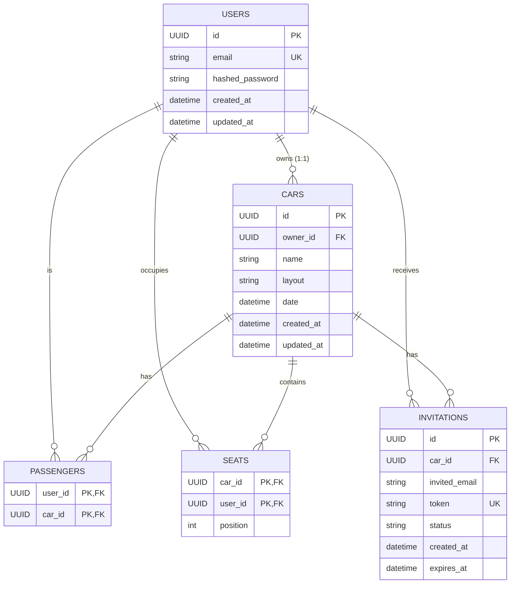

# ER Diagram - Současný Stav (1:1 User:Car)

```mermaid
erDiagram
    USERS {
        UUID id PK
        string email UK
        string hashed_password
        datetime created_at
        datetime updated_at
    }
    
    CARS {
        UUID id PK
        UUID owner_id FK
        string name
        string layout
        datetime date
        datetime created_at
        datetime updated_at
    }
    
    PASSENGERS {
        UUID user_id PK,FK
        UUID car_id PK,FK
    }
    
    SEATS {
        UUID car_id PK,FK
        UUID user_id PK,FK
        int position
    }
    
    INVITATIONS {
        UUID id PK
        UUID car_id FK
        string invited_email
        string token UK
        string status
        datetime created_at
        datetime expires_at
    }
    
    USERS ||--o{ CARS : "owns (1:1)"
    USERS ||--o{ PASSENGERS : "is"
    USERS ||--o{ SEATS : "occupies"
    USERS ||--o{ INVITATIONS : "receives"
    CARS ||--o{ PASSENGERS : "has"
    CARS ||--o{ SEATS : "contains"
    CARS ||--o{ INVITATIONS : "has"
```

**Aktuální omezení:**

- Jeden uživatel může vlastnit pouze jedno auto (1:1)
- Řidič = majitel auta
- Žádná historie přiřazení řidičů
