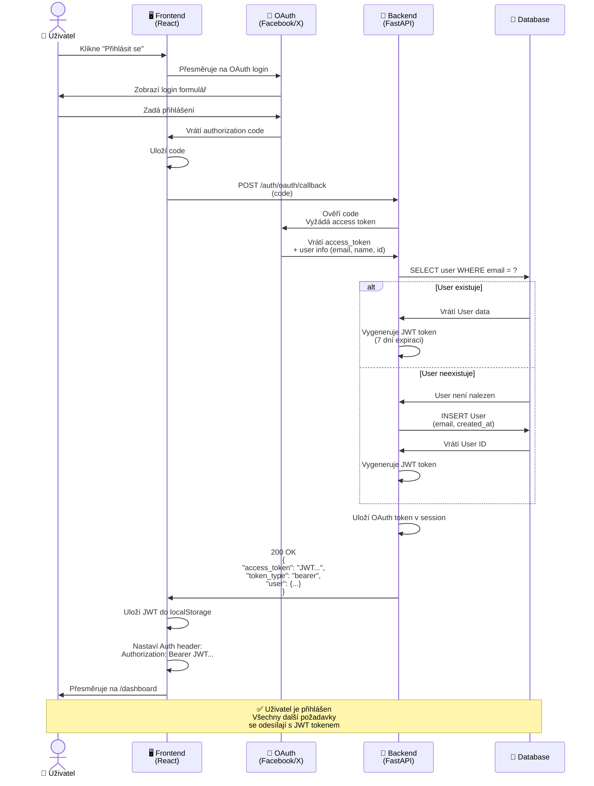

# Sekvenční Diagram - OAuth Login Flow

## Klíčové kroky:

1. **OAuth flow** - uživatel se přihlásí přes Facebook/X
2. **Code exchange** - frontend vymění authorization code za access token
3. **User lookup** - backend hledá uživatele podle emailu
4. **Auto-registration** - pokud user neexistuje, vytvoří se automaticky
5. **JWT generation** - backend vrátí vlastní JWT token (7 dní)
6. **Local storage** - frontend uloží JWT pro další požadavky

## Výhody tohoto přístupu:

- ✅ OAuth token zůstává na backendu (bezpečnější)
- ✅ Frontend používá JWT (bezstavová autentizace)
- ✅ Plná kontrola nad expirací (můžete nastavit 7 dní)
- ✅ Možnost refreshu tokenu
