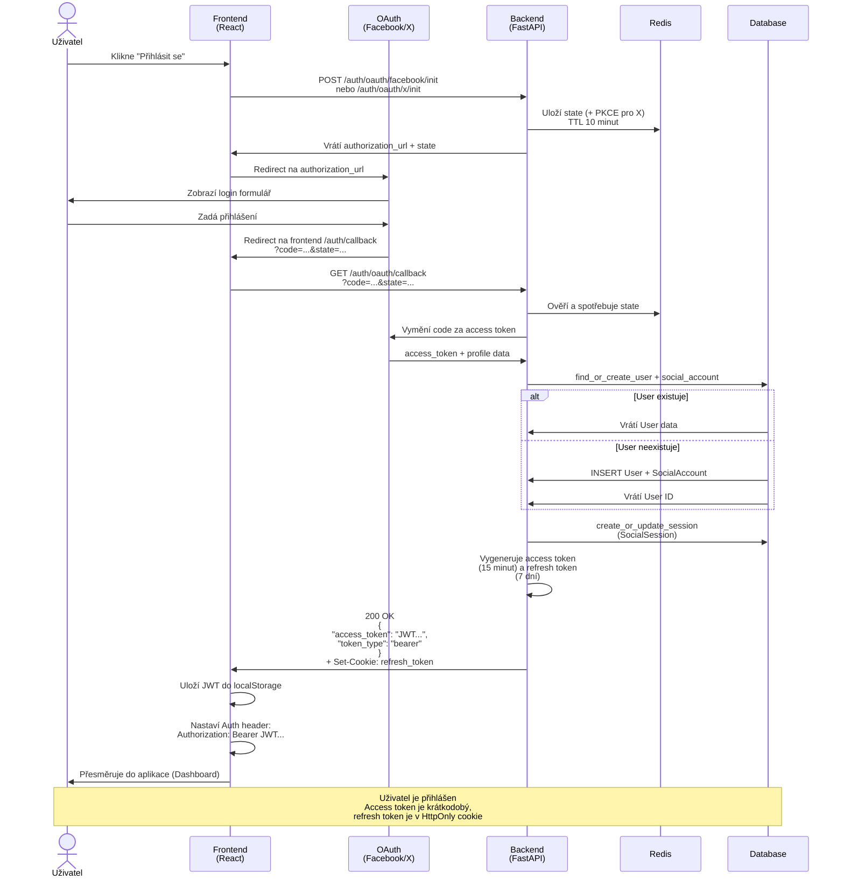

# Sekvenční Diagram - OAuth Login Flow

```mermaid
sequenceDiagram
    actor User as Uživatel
    participant Frontend as Frontend<br/>(React)
    participant AuthProvider as OAuth<br/>(Facebook/X)
    participant Backend as Backend<br/>(FastAPI)
    participant Redis as Redis
    participant Database as Database

    User->>Frontend: Klikne "Přihlásit se"
    Frontend->>Backend: POST /auth/oauth/facebook/init<br/>nebo /auth/oauth/x/init
    Backend->>Redis: Uloží state (+ PKCE pro X)<br/>TTL 10 minut
    Backend->>Frontend: Vrátí authorization_url + state
    Frontend->>AuthProvider: Redirect na authorization_url
    AuthProvider->>User: Zobrazí login formulář
    User->>AuthProvider: Zadá přihlášení
    AuthProvider->>Frontend: Redirect na frontend /auth/callback<br/>?code=...&state=...
    Frontend->>Backend: GET /auth/oauth/callback<br/>?code=...&state=...
    Backend->>Redis: Ověří a spotřebuje state
    Backend->>AuthProvider: Vymění code za access token
    AuthProvider->>Backend: access_token + profile data
    Backend->>Database: find_or_create_user + social_account
    
    alt User existuje
        Database->>Backend: Vrátí User data
    else User neexistuje
        Database->>Backend: INSERT User + SocialAccount
        Database->>Backend: Vrátí User ID
    end
    
    Backend->>Database: create_or_update_session<br/>(SocialSession)
    Backend->>Backend: Vygeneruje access token<br/>(15 minut) a refresh token<br/>(7 dní)
    Backend->>Frontend: 200 OK<br/>{<br/>  "access_token": "JWT...",<br/>  "token_type": "bearer"<br/>}<br/>+ Set-Cookie: refresh_token
    Frontend->>Frontend: Uloží JWT do localStorage
    Frontend->>Frontend: Nastaví Auth header:<br/>Authorization: Bearer JWT...
    Frontend->>User: Přesměruje do aplikace (Dashboard)
    
    Note over User,Database: Uživatel je přihlášen<br/>Access token je krátkodobý,<br/>refresh token je v HttpOnly cookie
```

## Klíčové kroky:

1. **OAuth flow** - uživatel se přihlásí přes Facebook/X
2. **State + PKCE** - backend uloží state do Redis, X používá PKCE
3. **SPA Callback** - OAuth provider přesměruje na frontend callback stránku `/auth/callback`, která následně volá API `/auth/oauth/callback`
4. **Code exchange** - backend vymění authorization code za provider access token
5. **Auto-registration** - pokud user neexistuje, vytvoří se automaticky
6. **JWT generation** - backend vrátí krátkodobý access token (15 minut)
7. **Refresh cookie** - dlouhodobý refresh token je v HttpOnly cookie

## Výhody tohoto přístupu:

- OAuth token zůstává na backendu (bezpečnější)
- Frontend používá JWT access token
- Plná kontrola nad expirací (access 15 minut, refresh 7 dní)
- Možnost refreshu tokenu přes HttpOnly cookie
