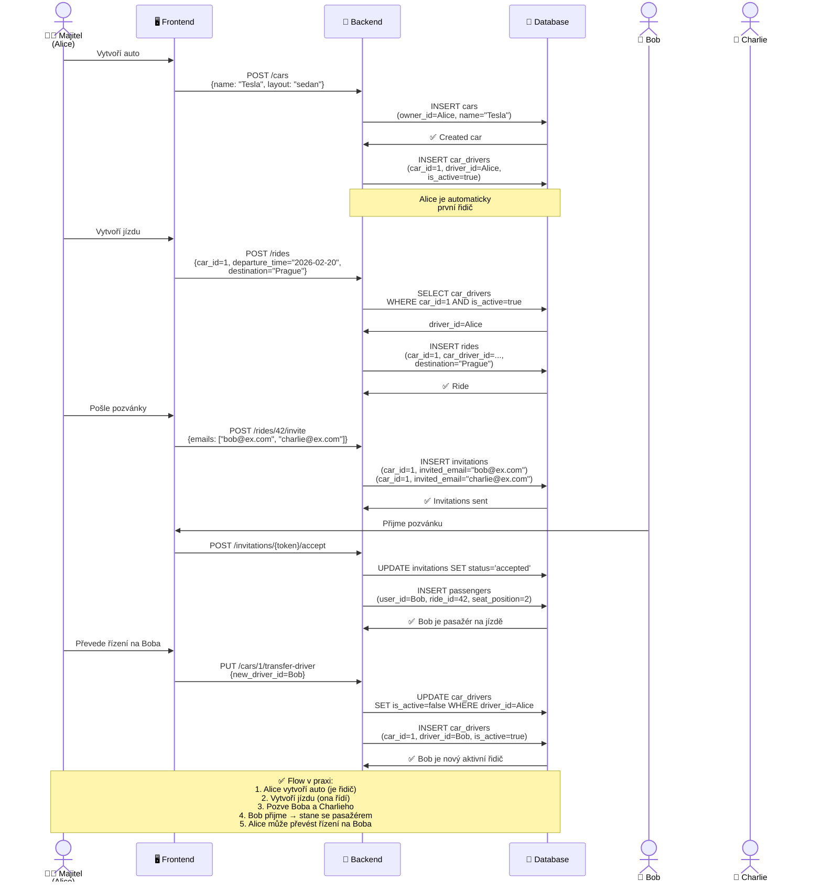

# Sekvenční Diagram - Více aut a přenos řidiče

## Scénář:

1. **Alice** vytvoří auto → stává se automaticky prvním řidičem
2. **Alice** vytvoří jízdu → ona je defaultně řidič
3. **Alice** pošle pozvánky **Bobovi** a **Charliemu**
4. **Bob** přijme pozvánku → stává se pasažérem na jízdě
5. **Alice** převede řízení na **Boba** → Bob se stává aktivním řidičem
6. Historie v `car_drivers`: Alice → Bob (tracked)

## Výhody:

- ✅ Majitel je automaticky první řidič
- ✅ Řízení lze převést pouze na uživatele, kteří přijali pozvánku
- ✅ Historie přenosů řízení (`car_drivers`)
- ✅ Jen jeden aktivní řidič na auto (`is_active=true`)
- ✅ Flexibilní delegování odpovědnosti
