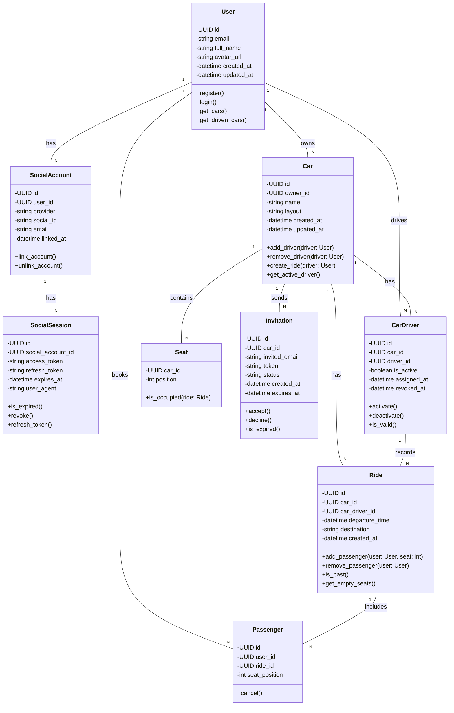

# Class Diagram - Python SQLAlchemy Modely

## Klíčové třídy:

### 🔐 Autentizace

- **User** - základní profil uživatele
- **SocialAccount** - propojení s OAuth providerem
- **SocialSession** - dočasné tokeny

### 🚗 Doména aplikace

- **Car** - auta vlastněná uživateli
- **CarDriver** - historie přiřazení řidičů
- **Ride** - konkrétní jízdy
- **Seat** - definice sedadel v autě
- **Passenger** - účast uživatele na jízdě
- **Invitation** - pozvánky k jízdě

## Poznámky:

- Všechny modely používají **UUID** jako primární klíč
- **Seat** má composite PK `(car_id, position)`
- Stavy jsou odvozovány z času (nepotřebujeme `status` fieldy)
