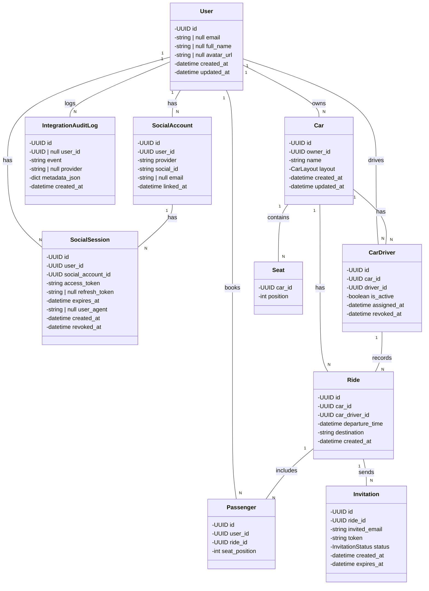

# Class Diagram - Python SQLAlchemy Modely

```mermaid
classDiagram
    class User {
        -UUID id
        -string | null email
        -string | null full_name
        -string | null avatar_url
        -datetime created_at
        -datetime updated_at
    }

    class SocialAccount {
        -UUID id
        -UUID user_id
        -string provider
        -string social_id
        -string | null email
        -datetime linked_at
    }

    class SocialSession {
        -UUID id
        -UUID user_id
        -UUID social_account_id
        -string access_token
        -string | null refresh_token
        -datetime expires_at
        -string | null user_agent
        -datetime created_at
        -datetime revoked_at
    }

    class IntegrationAuditLog {
        -UUID id
        -UUID | null user_id
        -string event
        -string | null provider
        -dict metadata_json
        -datetime created_at
    }

    class Car {
        -UUID id
        -UUID owner_id
        -string name
        -CarLayout layout
        -datetime created_at
        -datetime updated_at
    }

    class CarDriver {
        -UUID id
        -UUID car_id
        -UUID driver_id
        -boolean is_active
        -datetime assigned_at
        -datetime revoked_at
    }

    class Ride {
        -UUID id
        -UUID car_id
        -UUID car_driver_id
        -datetime departure_time
        -string destination
        -datetime created_at
    }

    class Passenger {
        -UUID id
        -UUID user_id
        -UUID ride_id
        -int seat_position
    }

    class Seat {
        -UUID car_id
        -int position
    }

    class Invitation {
        -UUID id
        -UUID ride_id
        -string invited_email
        -string token
        -InvitationStatus status
        -datetime created_at
        -datetime expires_at
    }

    User "1" -- "N" Car : owns
    User "1" -- "N" SocialAccount : has
    User "1" -- "N" SocialSession : has
    User "1" -- "N" IntegrationAuditLog : logs
    User "1" -- "N" CarDriver : drives
    User "1" -- "N" Passenger : books
    
    SocialAccount "1" -- "N" SocialSession : has
    
    Car "1" -- "N" CarDriver : has
    Car "1" -- "N" Ride : has
    Car "1" -- "N" Seat : contains
    
    CarDriver "1" -- "N" Ride : records
    
    Ride "1" -- "N" Passenger : includes
    Ride "1" -- "N" Invitation : sends
```

## Poznámky:

### 📐 Architektura

- **Data modely** - definovány pomocí SQLAlchemy ORM
- **Business logika** - implementována v routerech (FastAPI), ne na modelech
- **Schémata** - Pydantic modely pro validaci a serializaci

### 🔑 Klíčové vlastnosti

- Všechny modely používají **UUID** jako primární klíč
- `User.email` a `SocialAccount.email` jsou nullable
- `SocialSession.refresh_token` je nullable, `user_agent` je nullable
- **Seat** má composite PK `(car_id, position)`
- **CarDriver** vzniká až při vytvoření první jízdy, ne při vytvoření auta
- Pouze jeden `is_active=true` CarDriver na auto

### 🔐 OAuth Flow

- **SocialAccount** - trvalé propojení s OAuth providerem (Facebook, X)
- **SocialSession** - dočasné tokeny s dual FK na User i SocialAccount
- **IntegrationAuditLog** - auditní záznamy pro OAuth a integrace
