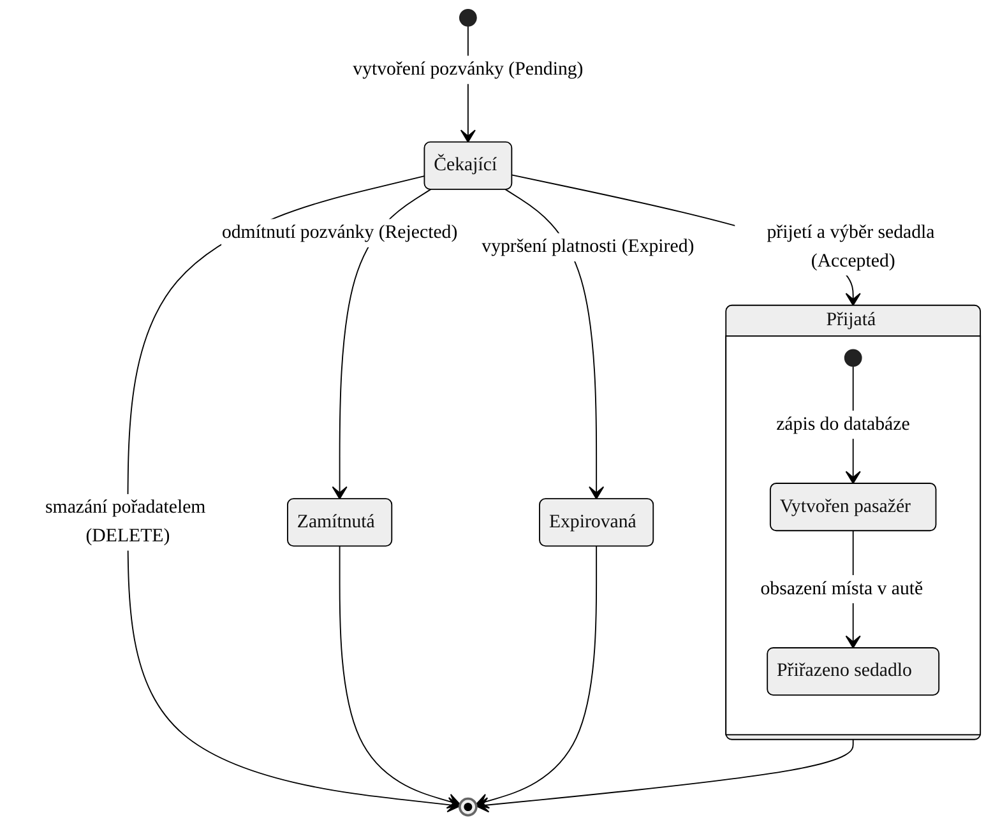

# State Diagram – Životní cyklus pozvánky

Tento stavový diagram znázorňuje stavy, kterými prochází pozvánka od svého vytvoření až po ukončení platnosti nebo přijetí. Stavy odpovídají hodnotám enumerátoru `InvitationStatus` v databázi.

