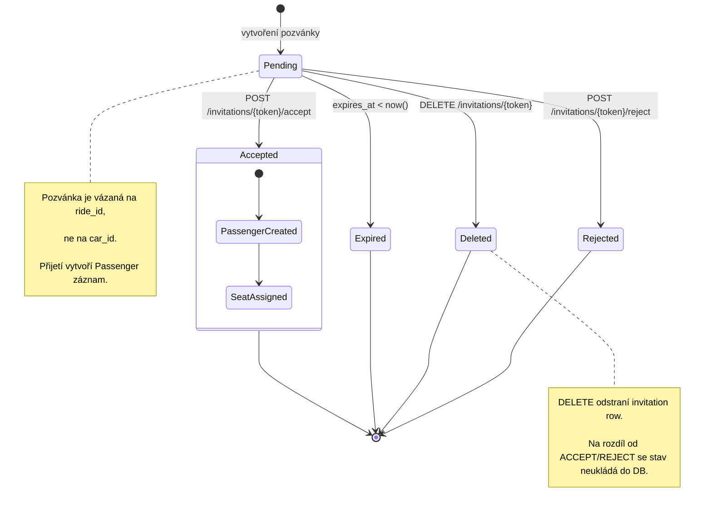

# State Diagram - Lifecycle Pozvánky a Účasti na Jízdě

## Co diagram pokrývá

- Přechody pozvánky mezi `PENDING`, `ACCEPTED`, `REJECTED` a expirací
- Mazání pozvánky vlastníkem auta
- Vazbu mezi přijetím pozvánky a vytvořením `Passenger`
