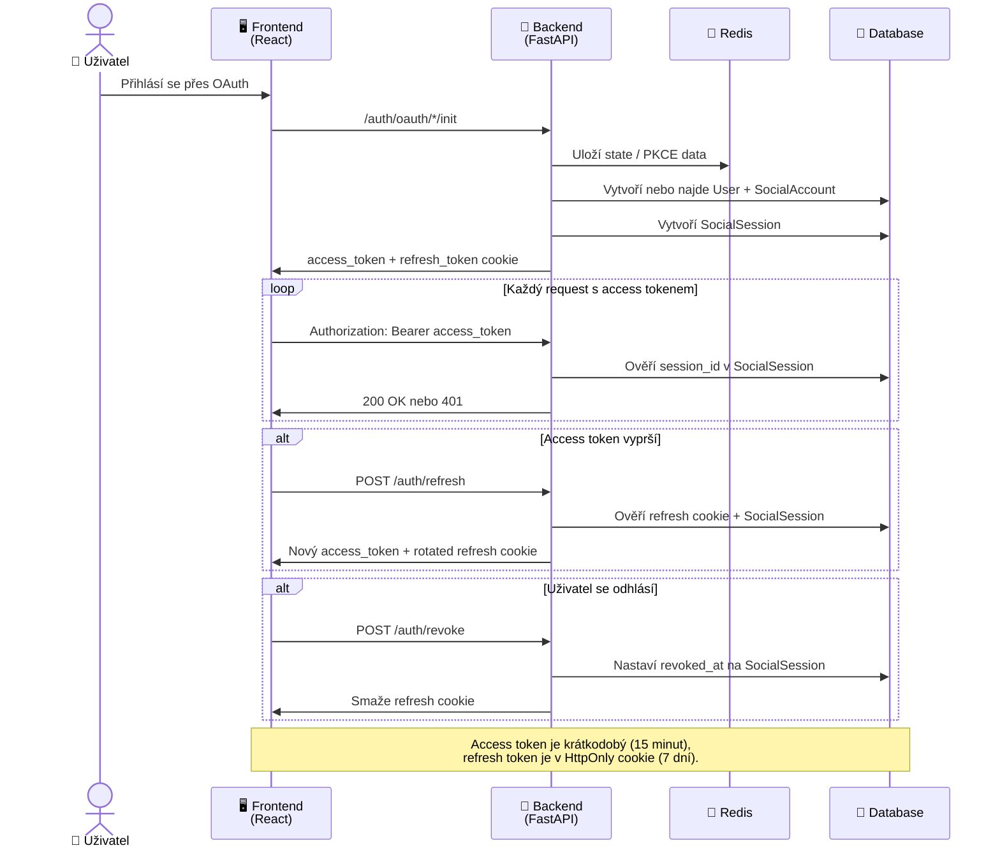

# Sekvenční Diagram - Životní Cyklus Access/Refresh Session

## Co diagram pokrývá

- Login session po OAuth callbacku
- Ověřování access tokenu na každém requestu
- Refresh flow přes HttpOnly cookie
- Revokaci session při logoutu
