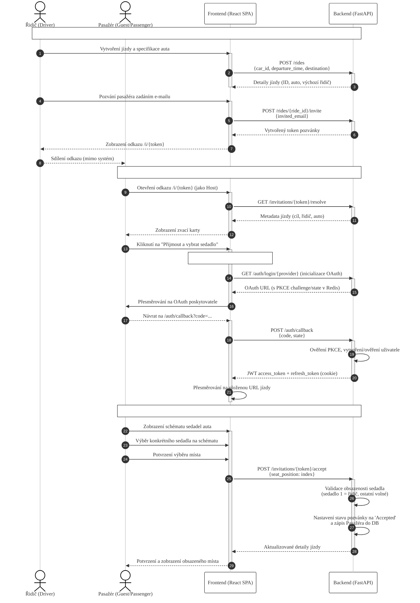

# Sekvenční diagram – Interakce Řidiče a Pasažéra (Rezervace)

Tento diagram znázorňuje procesní interakce mezi řidičem a spolucestujícím při plánování společné jízdy a usazování do auta.

```mermaid
%%{init: {"theme": "neutral", "themeVariables": {"fontFamily": "sans-serif", "actorBkg": "#ffffff", "actorBorder": "#000000", "noteBkgColor": "#ffffff", "noteBorderColor": "#000000"}}}%%
sequenceDiagram
    autonumber
    actor Rodic as Řidič (Driver)
    actor Pasazer as Pasažér (Guest/Passenger)
    participant Frontend as Frontend (React SPA)
    participant Backend as Backend (FastAPI)

    %% Sekce 1: Vytvoření jízdy a odeslání pozvánky
    Note over Rodic, Backend: 1. Vytvoření jízdy a odeslání pozvánky
    Rodic->>Frontend: Vytvoření jízdy a specifikace auta
    activate Frontend
    Frontend->>Backend: POST /rides<br/>{car_id, departure_time, destination}
    activate Backend
    Backend-->>Frontend: Detaily jízdy (ID, auto, výchozí řidič)
    deactivate Backend
    deactivate Frontend

    Rodic->>Frontend: Pozvání pasažéra zadáním e-mailu
    activate Frontend
    Frontend->>Backend: POST /rides/{ride_id}/invite<br/>{invited_email}
    activate Backend
    Backend-->>Frontend: Vytvořený token pozvánky
    deactivate Backend
    Frontend-->>Rodic: Zobrazení odkazu /i/{token}
    deactivate Frontend

    Rodic-->>Pasazer: Sdílení odkazu (mimo systém)

    %% Sekce 2: Ověření pozvánky a OAuth přihlášení
    Note over Pasazer, Backend: 2. Ověření pozvánky a OAuth přihlášení
    Pasazer->>Frontend: Otevření odkazu /i/{token} (jako Host)
    activate Frontend
    Frontend->>Backend: GET /invitations/{token}/resolve
    activate Backend
    Backend-->>Frontend: Metadata jízdy (cíl, řidič, auto)
    deactivate Backend
    Frontend-->>Pasazer: Zobrazení zvací karty
    deactivate Frontend

    Pasazer->>Frontend: Kliknutí na "Přijmout a vybrat sedadlo"
    activate Frontend
    Note over Frontend: Uložení redirect URL do localStorage
    Frontend->>Backend: GET /auth/login/{provider} (inicializace OAuth)
    activate Backend
    Backend-->>Frontend: OAuth URL (s PKCE challenge/state v Redis)
    deactivate Backend
    Frontend->>Pasazer: Přesměrování na OAuth poskytovatele
    deactivate Frontend

    Pasazer-->>Frontend: Návrat na /auth/callback?code=...
    activate Frontend
    Frontend->>Backend: POST /auth/callback<br/>{code, state}
    activate Backend
    Backend->>Backend: Ověření PKCE, vytvoření/ověření uživatele
    Backend-->>Frontend: JWT access_token + refresh_token (cookie)
    deactivate Backend
    Frontend->>Frontend: Přesměrování na uloženou URL jízdy
    deactivate Frontend

    %% Sekce 3: Výběr sedadla a dokončení rezervace
    Note over Pasazer, Backend: 3. Výběr sedadla a dokončení rezervace
    Pasazer->>Frontend: Zobrazení schématu sedadel auta
    activate Frontend
    Pasazer->>Frontend: Výběr konkrétního sedadla na schématu
    Pasazer->>Frontend: Potvrzení výběru místa
    Frontend->>Backend: POST /invitations/{token}/accept<br/>{seat_position: index}
    activate Backend
    Backend->>Backend: Validace obsazenosti sedadla<br/>(sedadlo 1 = řidič, ostatní volné)
    Backend->>Backend: Nastavení stavu pozvánky na 'Accepted'<br/>a zápis Pasažéra do DB
    Backend-->>Frontend: Aktualizované detaily jízdy
    deactivate Backend
    Frontend-->>Pasazer: Potvrzení a zobrazení obsazeného místa
    deactivate Frontend
```
