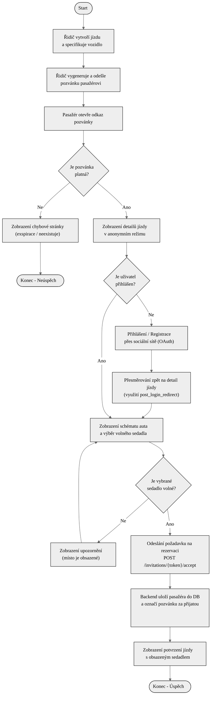

# Diagram aktivit – Tok rezervace sedadla pasažérem

Tento diagram aktivit znázorňuje procesní kroky, větvení a stavy při schvalování pozvánky a výběru sedadla.

```mermaid
%%{init: {"theme": "neutral", "themeVariables": {"fontFamily": "sans-serif", "nodeBkg": "#ffffff", "nodeBorder": "#000000"}}}%%
flowchart TD
    Start([Start]) --> CreateRide["Řidič vytvoří jízdu<br/>a specifikuje vozidlo"]
    CreateRide --> SendInvite["Řidič vygeneruje a odešle<br/>pozvánku pasažérovi"]
    SendInvite --> OpenLink["Pasažér otevře odkaz pozvánky"]
    
    OpenLink --> DecisionValid{"Je pozvánka<br/>platná?"}
    DecisionValid -- Ne --> ErrorPage["Zobrazení chybové stránky<br/>(exspirace / neexistuje)"]
    ErrorPage --> EndError([Konec - Neúspěch])
    
    DecisionValid -- Ano --> ShowDetails["Zobrazení detailů jízdy<br/>v anonymním režimu"]
    ShowDetails --> DecisionAuth{"Je uživatel<br/>přihlášen?"}
    
    DecisionAuth -- Ne --> LoginOAuth["Přihlášení / Registrace<br/>přes sociální sítě (OAuth)"]
    LoginOAuth --> RedirectBack["Přesměrování zpět na detail jízdy<br/>(využití post_login_redirect)"]
    RedirectBack --> SelectSeat
    
    DecisionAuth -- Ano --> SelectSeat["Zobrazení schématu auta<br/>a výběr volného sedadla"]
    
    SelectSeat --> DecisionSeat{"Je vybrané<br/>sedadlo volné?"}
    DecisionSeat -- Ne --> SeatError["Zobrazení upozornění<br/>(místo je obsazené)"]
    SeatError --> SelectSeat
    
    DecisionSeat -- Ano --> ConfirmReservation["Odeslání požadavku na rezervaci<br/>POST /invitations/{token}/accept"]
    ConfirmReservation --> UpdateDB["Backend uloží pasažéra do DB<br/>a označí pozvánku za přijatou"]
    UpdateDB --> ShowConfirmation["Zobrazení potvrzení jízdy<br/>s obsazeným sedadlem"]
    ShowConfirmation --> EndSuccess([Konec - Úspěch])
```
