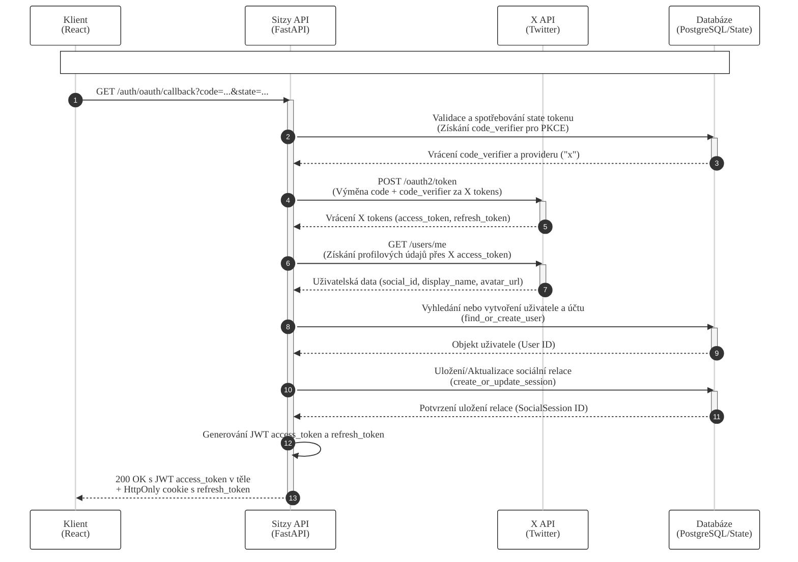

# Sekvenční diagram – Výměna autorizačního kódu za tokeny (X / Twitter)

Tento diagram znázorňuje proces výměny autorizačního kódu (Authorization Code) získaného z X (Twitter) za přístupové tokeny v systému Sitzy za použití mechanismu PKCE.

