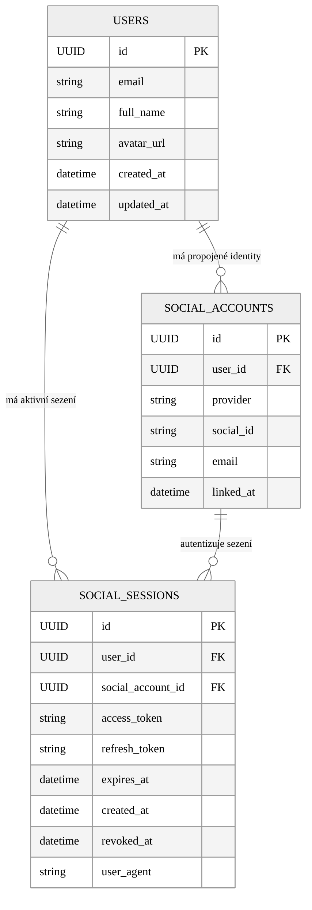

# ER Diagram – Uživatelské účty a OAuth relace

Tento diagram zobrazuje výsek databázového schématu zaměřený na tabulku USERS a její vazby na identity (SOCIAL_ACCOUNTS) a sezení (SOCIAL_SESSIONS).

