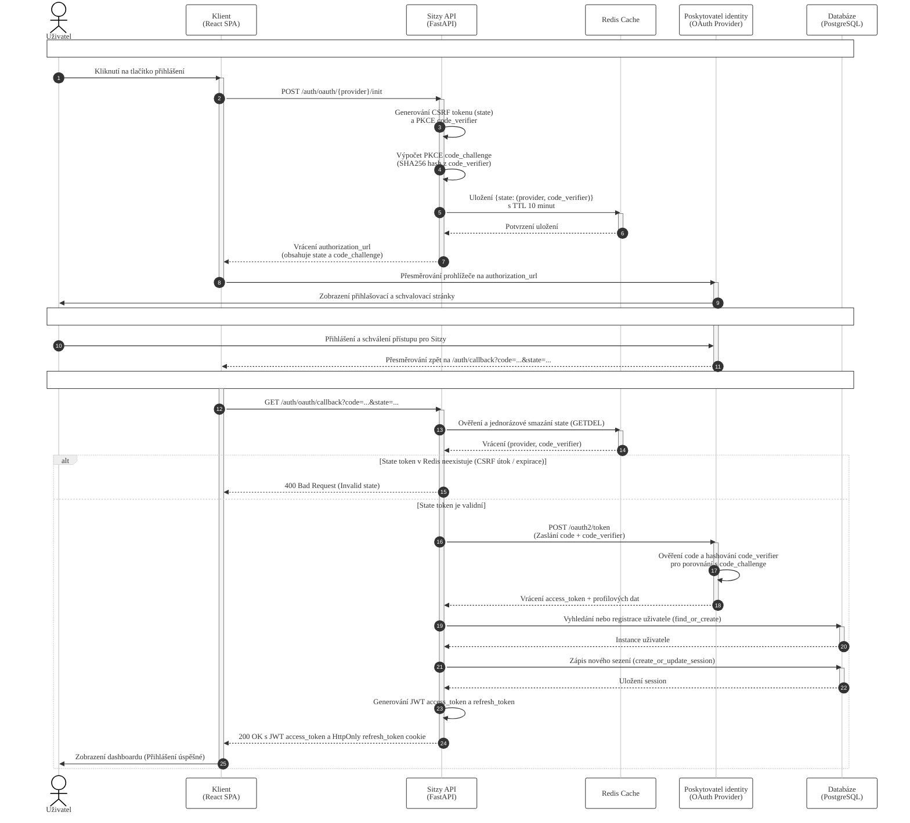

# Sekvenční diagram – Delegovaná bezheslová autentizace s ochranou CSRF a PKCE

Tento diagram popisuje detailní průběh přihlášení uživatele prostřednictvím OAuth 2.0 s využitím PKCE (Proof Key for Code Exchange) a jednorázového stavového tokenu (state) jako ochrany proti CSRF (Cross-Site Request Forgery) a replay útokům.

