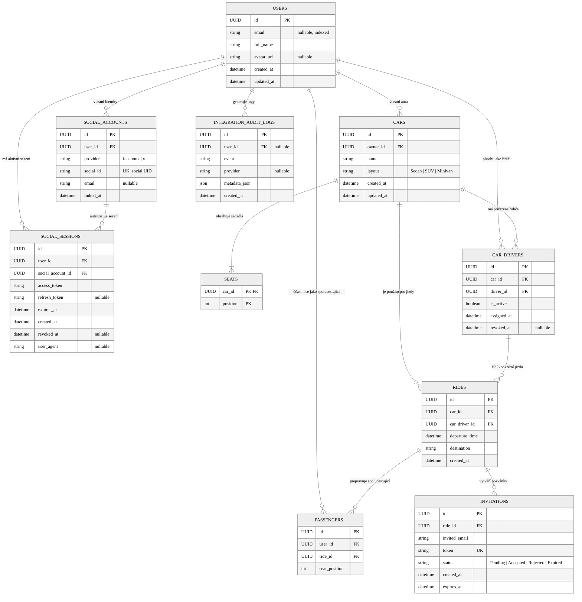

# Normalizované entitně-relační schéma databáze (ERD) – Sitzy

Tento diagram znázorňuje kompletní normalizované relační schéma PostgreSQL databáze aplikace Sitzy včetně typů entit, primárních a cizích klíčů a kardinalit vazeb.

