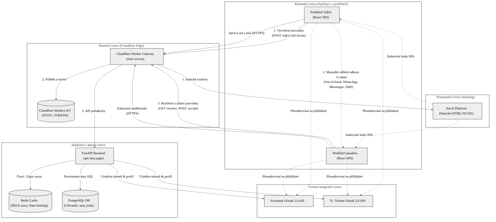

# Diagram integrační architektury a technologických hranic

Tento diagram znázorňuje celkovou architekturu systému Sitzy, technologické hranice jednotlivých komponent a toky dat mezi klientskou částí (prohlížeče řidiče a pasažéra), hraničním gatewayem (Cloudflare Worker), aplikačním backendem (FastAPI) a externími integračními službami, s explicitním vyznačením toku generování a sdílení pozvánky.

