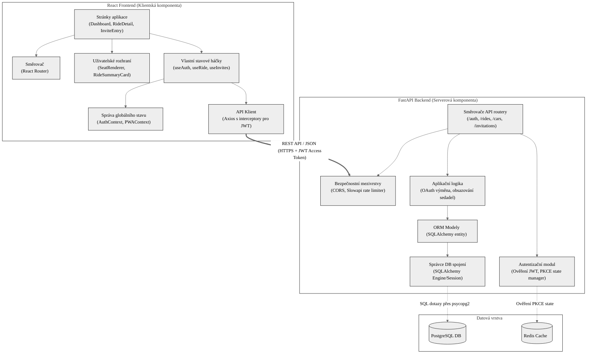

# UML Komponentní diagram (Component Diagram) – Sitzy

Tento diagram znázorňuje vnitřní logickou strukturu systému Sitzy. Zobrazuje jednotlivé softwarové komponenty v rámci klientské části (React), serverové části (FastAPI) a jejich vzájemné vazby, rozhraní a závislosti.

